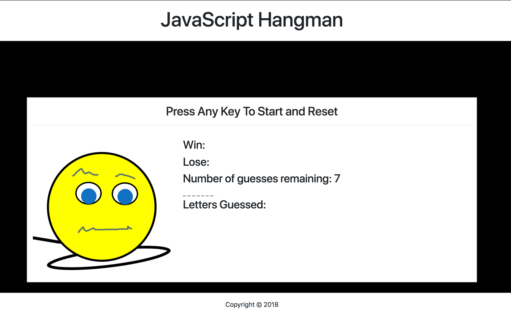

# JavaScript Hangman App

## URL

https://ac5599656.github.io/Word-Guess-Game/

## Screenshots

## Summary

JavaScript Hangman app allows users to play the hangman based on 
JavaScript terminology. Users get seven chances to guesses the word.
Once users guess correctly, they get to move on to another word and get
points for wins.  

## More Description
The problem with the app was to allow to finish guessing the last letter before the pop appears and 
move on to a new word.

To resolve the issue, I use setTimeout.

## Technology Used

HTML/CSS/JavaScript/jQuery